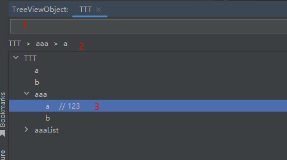
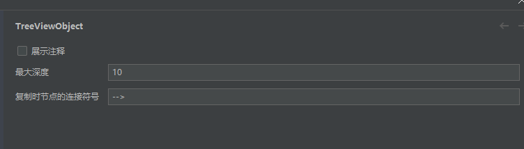

# TreeViewObject

## ToDo list
- [ ] 展开所有节点，收缩所有节点

## description
<!-- Plugin description -->
对对象做树形展示，支持搜索节点（在1输入搜索）、节点点击跳转（单击2或双击3）、复制路径（选中节点3，按ctrlC）

treeview an object, support search node(search in 1), jump to node by single click(2) or double click(3), copy path(select node 3, type ctrlC)

可配置最深层级、是否带注释、复制节点层级时的连接符号

configurable max depth, whether to show comment, the separator when copy node path

<!-- Plugin description end -->

